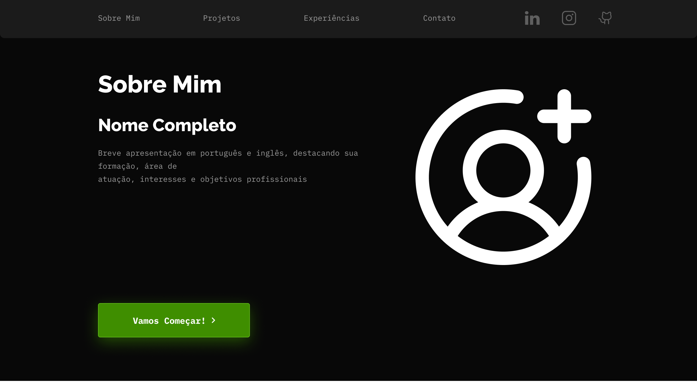
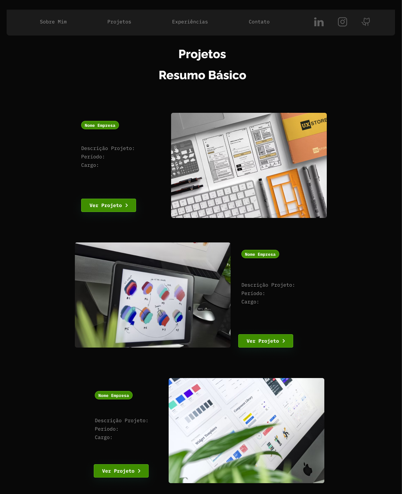
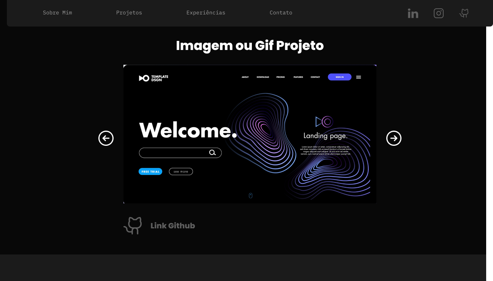
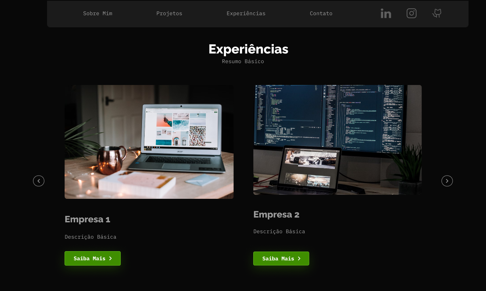
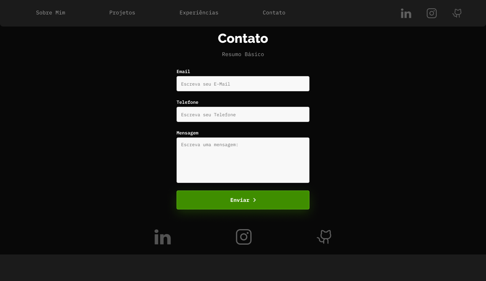

Markdown
# 💻 Portfólio Profissional — João Prado Campos

> Website de portfólio profissional moderno e responsivo desenvolvido para a disciplina de Laboratório de Desenvolvimento de Software da PUC Minas.

---

## 📌 Descrição do Projeto

Este projeto consiste em um website de portfólio pessoal interativo com o objetivo de apresentar minha trajetória acadêmica e profissional, habilidades técnicas, histórico de projetos e canais de contato de forma clara e acessível.

- Objetivo: exibir perfil profissional, linha do tempo de projetos, histórico de experiências e disponibilizar canal direto de contato com formulário de envio por e-mail e links sociais.
- Público-alvo: recrutadores, desenvolvedores, professores e profissionais da área de tecnologia.

---

## 📄 Seções da Aplicação

O sistema conta com 5 páginas principais acessadas por meio do menu de navegação:

1. Sobre Mim (`/`): breve apresentação em português e inglês, destacando formação, áreas de atuação (Engenharia de Software e Desenvolvimento), interesses e objetivos profissionais.
2. Projetos (`/projetos`): linha do tempo dinâmica dos projetos desenvolvidos, contendo nome, descrição, tecnologias utilizadas, link para repositório do GitHub e mídia interativa (imagens/GIFs).
3. Detalhes Projetos (`/projetos/:projectName`): páginas individuais de cada projeto que apresentam mais informações e detalhes sobre eles, além de uma exibição por meio de fotos, vídeos ou GIFs.
4. Experiências (`/experiencias`): espaço estruturado para relatar experiências profissionais, estágios, trabalhos freelance e participações em eventos técnicos.
5. Contato (`/contato`): página com ícones sociais clicáveis (e-mail, LinkedIn, GitHub e WhatsApp) e formulário interativo de mensagem com funcionalidade de envio direto por e-mail.

O layout principal é composto por um cabeçalho de navegação persistente e uma área de conteúdo que exibe cada página conforme a rota acessada.

---

## 🛠️ Tecnologias e Dependências

### Core & Frameworks

- React.js (v18+): biblioteca principal para construção da interface de usuário.
- Vite: build tool e ambiente de desenvolvimento rápido.
- JavaScript (ES6+): linguagem base do projeto.

### Dependências & Bibliotecas

- react-router-dom: gerenciamento de rotas e navegação client-side SPA.
- react-icons: conjunto de ícones utilizado na navegação e nos links para redes sociais.
- embla-carousel-react: biblioteca utilizada para a implementação de carrosséis.
- framer-motion: biblioteca utilizada para animações e transições da interface.

### Ferramentas de Design & Versionamento

- Figma: prototipação de média e alta fidelidade da interface.
- Git & GitHub: controle de versão e hospedagem do código-fonte.
- ESLint: padronização e qualidade de código.

---

## 🎨 Protótipos (Wireframes & UI Design)

> 🔗 Link do Figma: [Clique aqui para acessar o protótipo no Figma](https://www.figma.com/design/e4Malif4A6em6Vo9LXrWvZ/Wireframes-portfolio?node-id=0-1&p=f&t=2WqPyH8JPjOn1BNB-0)

### Layouts das Telas











---

## 📁 Estrutura de Diretórios do Projeto

```text
Laboratorio1Portfolio/
├── code/
│   ├── public/img/            # Imagens públicas do portfólio
│   ├── src/
│   │   ├── assets/            # Recursos utilizados pela aplicação
│   │   ├── components/
│   │   │   ├── layout/        # Layout principal, navbar e cards
│   │   │   └── ui/            # Componentes visuais reutilizáveis
│   │   ├── data/experience.js # Dados das experiências
│   │   ├── pages/              # Páginas e telas da aplicação
│   │   ├── index.css           # Estilos globais
│   │   ├── main.jsx            # Ponto de entrada do React
│   │   └── routes.jsx          # Configuração centralizada de rotas
│   ├── eslint.config.js
│   ├── index.html
│   ├── package.json
│   └── vite.config.js
├── docs/                      # Imagens dos wireframes
└── README.md
```

---

## 🚀 Como Executar o Projeto Localmente

### Pré-requisitos

- Node.js (versão 18 ou superior)
- npm ou yarn instalado

### Passo a passo

1. Clone o repositório:

```bash
git clone https://github.com/Joao-Prado0/Repositorio-Lab-Desenvolvimento-Software-2026.2.git
```

2. Acesse a pasta do projeto:

```bash
cd Laboratorio1Portfolio
cd code
```

3. Instale as dependências:

```bash
npm install
```

4. Inicie o servidor de desenvolvimento:

```bash
npm run dev
```

5. Abra o navegador e acesse a URL exibida no terminal (geralmente http://localhost:5173).

---

## 🌐 Hospedagem na Nuvem

- Status: aplicação em desenvolvimento local; publicação em produção será definida posteriormente.

---

## 👤 Autor

João Prado Campos

Estudante de Engenharia de Software — PUC Minas